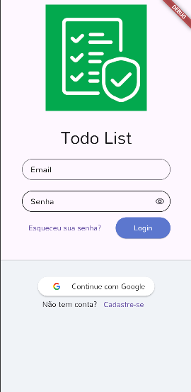
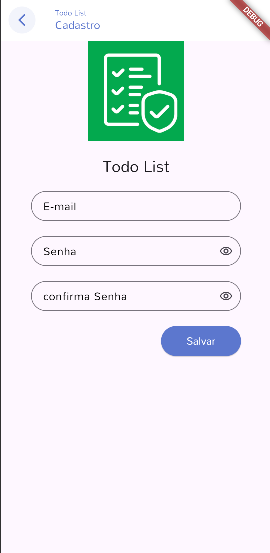
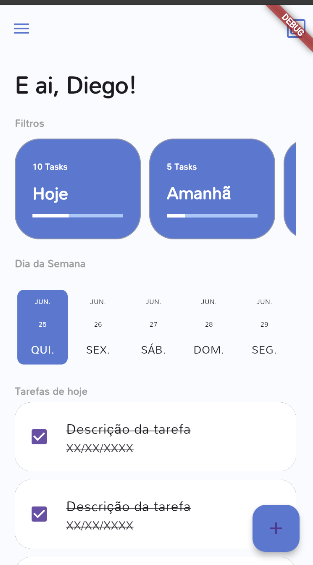

# Todo List App

Aplicativo de gerenciamento de tarefas desenvolvido em Flutter com foco em aprendizado, organização de código e aplicação de boas práticas de desenvolvimento mobile.

## Objetivo

O projeto tem como objetivo praticar conceitos fundamentais do Flutter, incluindo:

* Estruturação de projetos (Feature First)
* Navegação customizada e global entre telas
* Gerenciamento de estado reativo eficiente
* Persistência local de dados com bancos relacionais
* Organização em camadas isoladas (Clean Architecture de forma simplificada)
* Versionamento profissional com Git


## Tecnologias

* Flutter & Dart
* Firebase Authentication
* SQLite (sqflite)
* Provider
* Selector
* Date Picker Timeline
* Google Fonts
* Validatorless
* Flutter Overlay Loader
* Sign In Button
* Path

## 📱 Demonstração

<table>
  <tr>
    <td align="center">
      <h4>Login</h4>
      
    </td>
    <td align="center">
      <h4>Cadastro</h4>
      
    </td>
    <td align="center">
      <h4>Home Page</h4>
      
    </td>
  </tr>
</table>

## Organização das Pastas

### core/

Contém recursos globais compartilhados por toda a aplicação:

* Configuração do banco de dados SQLite e sistemas de Migrations
* Temas estruturados, cores e extensões de contexto (`theme_extensions`)
* Notifiers customizados de base (`DefaultChangeNotifier` e `DefaultListenerNotifier`)
* Componentes de navegação global, validadores e widgets reutilizáveis

### modules/

Organização baseada em funcionalidades (**Feature First**). Cada módulo encapsula suas próprias rotas, controladores e views.

#### Auth Module
Fluxo completo de entrada e segurança do usuário (Login, Cadastro e Recuperação de Credenciais).

#### Splash Module
Garante o carregamento inicial de serviços pesados e decide o rumo do usuário com base no estado da sessão.

#### Home Module

Responsável pela área principal da aplicação.

Atualmente contém:

- HomeHeader
- HomeDrawer
- HomeFilters
- TodoCardFilter

Toda a interface da Home é construída de forma componentizada para facilitar manutenção e reutilização.
#### Todo List Module
Módulo focado no núcleo da aplicação: manipulação e filtros de tarefas diárias.

### repositories/
Camada isolada de acesso a dados (Local com SQLite e Remoto com Firebase).

### services/
Camada intermediária contendo as regras de negócio da aplicação.


## Funcionalidades

### Concluído

* [x] Estrutura modular da aplicação (Feature First)
* [x] Configuração e inicialização do SQLite
* [x] Sistema robusto de Migrations para o banco local
* [x] Gerenciamento do ciclo de vida de conexões do banco de dados
* [x] Integração completa com Firebase SDK
* [x] Interfaces responsivas de Login e Cadastro
* [x] Fluxo de autenticação completo (Email/Senha, Google, Reset de Senha)
* [x] Validação estruturada de formulários com Validatorless
* [x] Tratamento centralizado de exceções nativas de autenticação
* [x] Sistema global de Loading customizado via Overlays
* [x] Sistema padronizado de feedbacks visuais (Mensagens de Erro e Sucesso)
* [x] Notifier Pattern para controle reativo de estados de UI
* [x] Repository e Service Patterns implementados em camadas isoladas
* [x] Monitoramento global e persistente da sessão do usuário com Firebase
* [x] Redirecionamento automatizado baseado no estado do `userChanges()`
* [x] Navegação desacoplada da árvore de UI utilizando `NavigatorKey`
* [x] Renderização otimizada de dados de perfil (Nome e Foto) usando Selectors
* [x] Atualização em tempo real do Display Name do usuário logado através do Firebase
* [x] Estrutura inicial da Home Page
- [x] Cabeçalho personalizado da Home
- [x] Menu lateral (Drawer)
- [x] Cards de filtros de tarefas
- [x] Navegação horizontal entre filtros
- [x] Integração do Date Picker Timeline
- [x] Componentização da interface da Home

## Roadmap

### Em desenvolvimento

- [ ] CRUD completo de tarefas
- [ ] Persistência das tarefas no SQLite
- [ ] Filtro por período
- [ ] Pesquisa de tarefas
- [ ] Estatísticas
- [ ] Dark Mode
- [ ] Notificações locais
- [ ] Sincronização em nuvem


## Arquitetura e Padrões Aplicados

### Fluxo de Inicialização e Autenticação

 [ SplashPage (Rota Raiz '/') ]
                ↓
[ AuthProvider (Iniciado via AppModule) ]
↓
[ Escuta ativa ao userChanges() ]
↓
(Usuário está Autenticado?)
/

Sim                        Não
/

[ HomePage ]                 [ LoginPage ]


### Otimização com Selectors

Para evitar reconstruções desnecessárias na tela principal, a foto e o nome do usuário exibidos no `HomeDrawer` são envelopados individualmente em componentes `Selector`. Isso garante que o menu lateral só sofra re-render se o respectivo dado específico mudar no Firebase, mantendo a performance fluida.

```dart
Selector<AuthProvider, String>(
  selector: (context, authProvider) => authProvider.user?.displayName ?? "Não informado",
  builder: (_, name, __) => Text(name),
);
Presentation, Service e Repository Layers
A comunicação entre a interface do usuário e os dados segue um fluxo unidirecional rigoroso:

A UI (Page) captura o evento do usuário e interage com seu respectivo Controller.

O Controller delega a regra de negócio para a camada de Service (UserService).

O Service orquestra os dados utilizando a camada de Repository (UserRepository).

O Repository altera o estado remoto (Firebase) ou local (SQLite).

Como Executar
Certifique-se de possuir o ambiente Flutter configurado na sua máquina.

Clone o repositório

Instale as dependências do projeto:

Bash
flutter pub get
Execute o projeto em modo de desenvolvimento:

Bash
flutter run
Estrutura Atual do Projeto
├─ assets
│  └─ images
│     └─ logo.png
├─ lib
│  ├─ app
│  │  ├─ app_module.dart
│  │  ├─ app_widget.dart
│  │  ├─ core
│  │  │  ├─ auth
│  │  │  │  └─ auth_provider.dart
│  │  │  ├─ database
│  │  │  │  ├─ migrations
│  │  │  │  │  ├─ migration.dart
│  │  │  │  │  ├─ migration_v1.dart
│  │  │  │  │  └─ migration_v2.dart
│  │  │  │  ├─ sqlite_adm_connection.dart
│  │  │  │  ├─ sqlite_connection_factory.dart
│  │  │  │  └─ sqlite_migration_factory.dart
│  │  │  ├─ modules
│  │  │  │  ├─ todo_list_module.dart
│  │  │  │  └─ todo_list_page.dart
│  │  │  ├─ navigator
│  │  │  │  └─ todo_list_navigator.dart
│  │  │  ├─ notifier
│  │  │  │  ├─ default_change_notifier.dart
│  │  │  │  └─ default_listener_notifier.dart
│  │  │  ├─ ui
│  │  │  │  ├─ messages.dart
│  │  │  │  ├─ theme_extensions.dart
│  │  │  │  └─ todo_list_ui_config.dart
│  │  │  ├─ validators
│  │  │  │  └─ validators.dart
│  │  │  └─ widget
│  │  │     ├─ todo_list_field.dart
│  │  │     └─ todo_list_logo.dart
│  │  ├─ exceptions
│  │  │  └─ auth_exception.dart
│  │  ├─ models
│  │  ├─ modules
│  │  │  ├─ auth
│  │  │  │  ├─ auth_module.dart
│  │  │  │  ├─ login
│  │  │  │  │  ├─ login_controller.dart
│  │  │  │  │  └─ login_page.dart
│  │  │  │  └─ register
│  │  │  │     ├─ register_controller.dart
│  │  │  │     └─ register_page.dart
│  │  │  ├─ home
│  │  │  │  ├─ home_module.dart
│  │  │  │  ├─ home_page.dart
│  │  │  │  └─ widgets
│  │  │  │     ├─ home_drawer.dart
│  │  │  │     ├─ home_filters.dart
│  │  │  │     ├─ home_header.dart
│  │  │  │     ├─ home_tasks.dart
│  │  │  │     ├─ home_week_filter.dart
│  │  │  │     ├─ task.dart
│  │  │  │     └─ todo_card_filter.dart
│  │  │  └─ splash
│  │  │     └─ splash_page.dart
│  │  ├─ repositories
│  │  │  └─ user
│  │  │     ├─ user_repository.dart
│  │  │     └─ user_repository_impl.dart
│  │  └─ services
│  │     └─ user
│  │        ├─ user_service.dart
│  │        └─ user_service_impl.dart
│  ├─ firebase_options.dart
│  └─ main.dart

Status
🚧 Em desenvolvimento

Autor
Diego Sousa
```